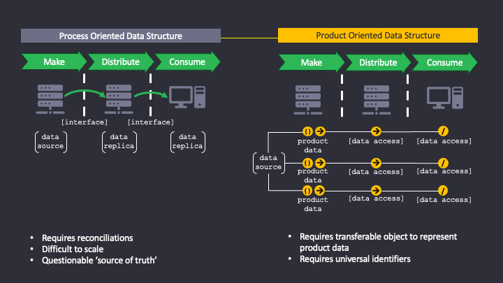
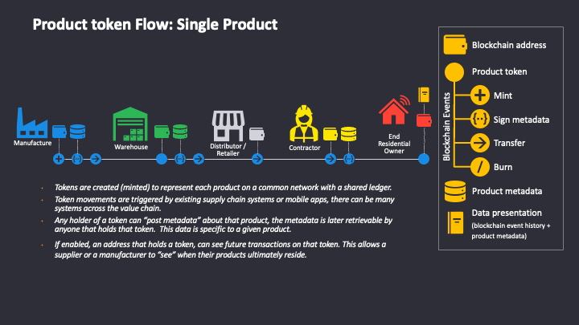
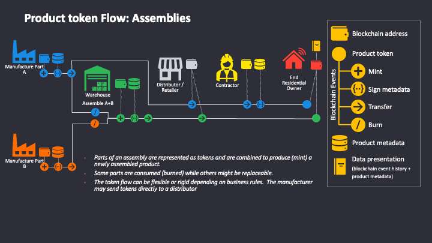
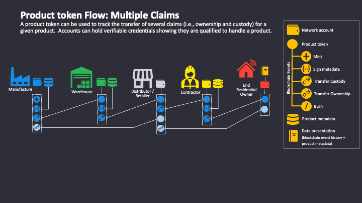

# Zeroth Settlement Solutions
This is the repo for the open source products and methods within Zeroth Settlement Solutions, Inc.  It is the subsidiary of Zeroth Technology Inc. that focuses on the confidential settlement of real-world products.  Our primary solution is:

## CSER

We think that the transfer of physical goods can be settled the same way we transfer digital currencies.  Our supply chains are broken and we have been focused on solving the wrong problem.

The goal Confidential Settlement with Embedded Rights (CSER) is to establish a new cryptographic primitive that can be used to agree upon a set of rules on how a product should be transferred and then use some novel cryptography to settle the transaction in a way that keeps the details known to only the trading partners but lets them provide proof that the settlement occurred. 

This is not going to be easy, supply chains involve a vast ecosystem of entrenched players and it cannot be known who will participate ahead of time.  So CSER also focuses on a way to embed user rights to a product into the transaction, these rights help to enforce the rules, but they also give the participant visibility into the history of transactions involving their products.

This only works if everyone can use it - it needs to be a common good.  This is not a popular point of view with existing supply chain software providers, so we need to prove its value and limitations first.

Our project is new, but we have been working on this for a long time....

***

It starts with rethinking the way that we try to connect supply chains using existing systems and how we expect information to flow.  Today each system winds up creating a data silo that contains information about all of the products that are, or were, goverend by it.  Shifting our orientation to the product we desire to create information that can more fluidly move across the supply chain.

Using tokens to represent the products we can easily start applying some of the standard rules of ERC-721 (i.e., transfering the token from one account to another is a settled transaction, you don't get to create a copy of it in the new account).  With standard *Mint, Transfer, Burn* type rules we can model some of the most complex supply chain scenarios.

Using aggregation and disaggregation we can emulate real-world supply chains (nobody sends individual items, they are almost alwas put in a box with other items), and we can create assemblies where several individual products work together to function as a whole (like all the parts in my car).

And we can do something that current systems struggle with... we can manage multiple claims against the product.  The two most common are custody and ownership (if you borrow my car I still own it but you have custody) but there are others claims suchs as leins (if I financed my car the bank has a claim on it as well).  Claims interact with one another and they establish the rights of claim holders.

And while these things are all great - none of it works without **confidentiality**. Even if we wanted to use a private network, if everyone in the supply chain could see what everyone else is doing it would never work... inventory levels and supply chain events are trade secrets, if competitors were able to infer how much supply you had of a product they could manipulate the market to their advantage.  CSER aims to accomplish the above, but keep the transactions confidential to only the parties involved.
